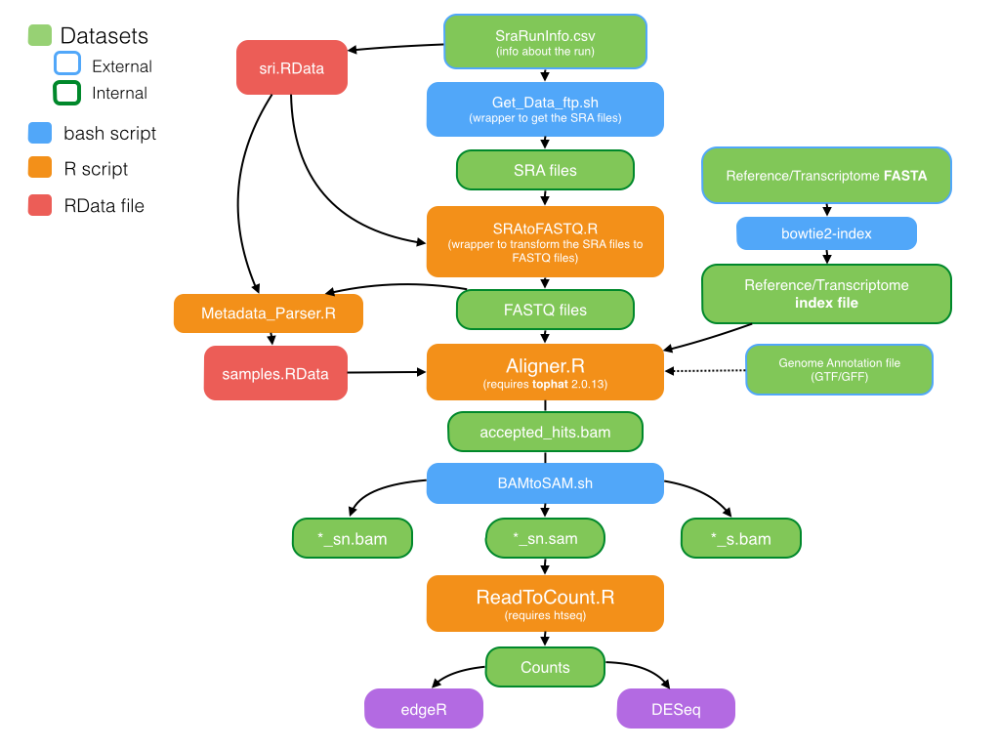
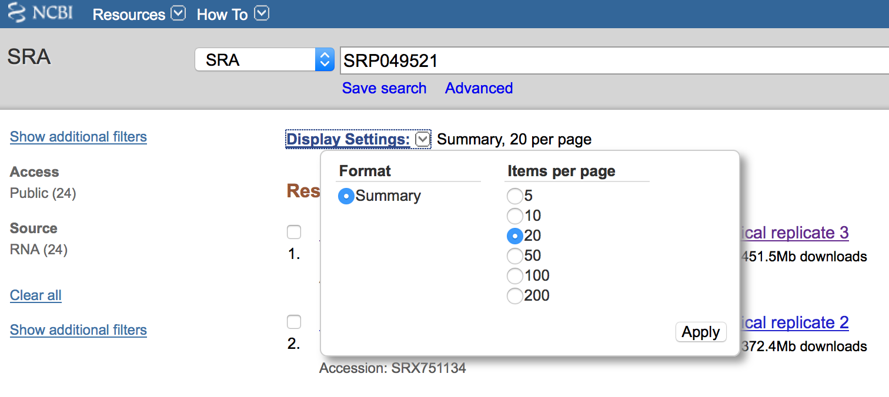

#**READ ME FIRST!!!**: 
> This document is for guidance only based on my *P. infestans* dataset. Please read carefully all the steps in order to change the input files. Each section has a **Script** and the Script is included in this repository inside the `script` folder, feel free to download them as needed or cloning the repository in case you are an advanced `git` used. The scripts do not have comments in order to make them easily modifiable but they are througly documented here!

***
## Flowchart of the steps


***
***


# Creating the SraRunInfo.csv

## If you have getting SRA files from the SRA archive, do the following:

1. Go to `Display Settings`, and in `Items per page` select 50 (I don't think you have more than 50 samples) and press apply



2. Then go to `Send To`, select `file` and in format select `RunInfo`


## If are not getting the data from the SRA

1. Open Excel or whatever spreadsheet program you like
2. Create a header with the following elements:

|LibraryName|LibraryLayout|download_path|
|---|---|---|
||||

  * `LibraryName` contains the name combination of the sample + treatment you are using (in my case, Strain_Fungicide)
  * `LibraryLayout` contains the info of the illumina reads. if pair ended used PAIRED, if single ended use SINGLE
  * `download_path` contains the path of the FASTQ files you are using for each sample
  
3. Save it as a comma-delimited text with the name `SraRunInfo.csv`

An example of my SRA table would be:

```{r, echo=FALSE, results='asis'}
library(knitr)
load("data/sri.RData")
kable(sri[,c("LibraryName","LibraryLayout","download_path" )])
```


***


# Creating the `sri.RData` file

>Program: **R**

```R
# Creating the sri data frame with all the info of the SraRunInfo.csv
sri = read.csv("data/SraRunInfo.csv", stringsAsFactors=FALSE)

#Saving the database in a new file
save(sri,file="sri.RData")

q()
```

***

# Obtaining the SRA/FASTQ files

>Program: **bash**

>Script: `Get_Data_ftp.sh`

We are splitting the rows of the `SraRunInfo.csv` file and obtaining the row that has the `download_path` column (Might vary in different files) to get the SRA or FASTQ files (depends on what you have on your `SraRunInfo.csv` table)

```bash
for i in $(cut -f 3 -d "," SraRunInfo.csv); do qsub Get_Data_ftp.sh $i; done
```

***

# Converting SRA to FASTQ

>Program: **R**

>Script: `SRAtoFASTQ.R`

```R
# Loading the data set
load("data/sri.RData")

# Creating a vector of the names of the `.sra` files
fs = basename(sri$download_path)

# Starting a counter for the run names
i = 1

# Loop: For each SRA, paste the SGE_Batch command to run fastq-dump and run it. (Is a condition of SGE_Batch to create a run name, in this case, the variable `i` which is a number that starts in 1 and increases by 1 everytime there is a new SRA is pasted to a `fastq` prefix, so the run names will be equivalent to `fastq$i`

for(f in fs) {
cmd = paste0("SGE_Batch -c '/raid1/teaching/CGRB/rnaseq_rhodes_winter_2015/RLibs/fastq-dump --split-3 ", f,"' -r fastq",i)
cat(cmd,"\n")
system(cmd) # invoke command
i = i + 1
}
```

***

#Parsing the Metadata

>Program: **R**

>Script: `Metadata_parser.R`

By Parsing the metadata we mean we are creating a new file (called `samples.RData`) that we will use in most of the subsequent scripts

```R
# load sri object
load("sri.RData")

# Create the `samples` data frame
samples = unique(sri[,c("LibraryName","LibraryLayout")])

# Loop: Match the sample name with the FASTQ file per sample
for(i in seq_len(nrow(samples))) {
        rw = (sri$LibraryName==samples$LibraryName[i])
        if(samples$LibraryLayout[i]=="PAIRED") {
        samples$fastq1[i] = paste0(sri$Run[rw],"_1.fastq",collapse=",")
        samples$fastq2[i] = paste0(sri$Run[rw],"_2.fastq",collapse=",")
        } else {
        samples$fastq1[i] = paste0(sri$Run[rw],".fastq",collapse=",")
        samples$fastq2[i] = ""
         }
        }
        
# Add descriptive column names
## Control:
samples$condition = "CTL" 

## Treatment (Anything that matches an identifier in the treatment samples. In my case, the `_Mef` identifier):
samples$condition[grep("_Mef",samples$LibraryName)] = "MET" 

## Create a short name: 
samples$shortname = paste(substr(samples$condition,1,2),  substr(samples$LibraryLayout,1,2),  seq_len(nrow(samples)), sep=".")

## Writing the new file
save(samples,file="data/samples.RData")
```

***

# Creating the bowtie index for the FASTA reference/transcriptome file

>Program: **bowtie2**

>Script: Run as indicated below

**REMEMBER:** the `-f` option is a flag for your **FASTA reference/transcriptome**, be aware to change it. The `Pinf_ref` argument is the name of the resulting index. Also change!

```bash
bowtie2-build -f /home/bpp/tabimaj/Grunwald_Lab/web_data/pinf_broad/pinf_super_contigs.fa Pinf_ref
```

***

# Aligning the reads to the reference using `tophat2`

>Program: **R + tophat**

>Script: `Alignment.R`

Here we are creating a wrapper to align the FASTQ we saved in the `samples.RData` file to the reference using `Tophat 2`

```R
# Loading the samples file
load("data/samples.RData")

# Loading the annotations (GTF/GFF) file [If there is no annotations file, ignore this and remove both the `-G` option for `tophat` and the `", gf, "` from the script]
gf = "/nfs0/Grunwald_Lab/home/tabimaj/RNAseq/phytophthora_infestans_t30-4_1_transcripts.gtf"

# Loading the FASTA reference/transcriptome index file
bowind = "Pinf_ref"

# Creating the command to run tophat2 for all the samples per treatment
cmd = with(samples, paste("SGE_Batch -c 'tophat -G", gf, "-p 5 -o", LibraryName, bowind, fastq1,"' -r ", LibraryName, "-P 5"))

# Running the samples
sapply(cmd, function(x) system(x))
```

***

# Converting BAM files to SAM files

>Program: **bash + samtools**

>Script: `BAMtoSAM.R`

>WARNING: I highly recommend that ALL FOLDERS THAT DO NOT HAVE THE `accepted_hits.bam` ARE ERASED or this parallel script will be worthless.

```bash
# This loops through ALL EXISTING DIRECTORIES looking for the accepted_hits.bam and doing the rest! Just Copy and Paste to bash (Remember to put the BAMtoSAM.sh file in your folder)

for i in $(ls -d */| perl -pe 's/\n/ /g'| sed 's/\///g'); do qsub BAMtoSAM.sh $i; done
```

***

# Obtaining the counts

>Program: **R + htseq**

>Script: `ReadCount.R`


>WARNING: IN CASE YOU DON'T HAVE `htseq-count` DO THE FOLLOWING IN BASH (Not in R)

```bash
cd ~
wget https://pypi.python.org/packages/source/H/HTSeq/HTSeq-0.6.1.tar.gz#md5=b7f4f38a9f4278b9b7f948d1efbc1f05
tar -zxvf HTSeq-0.6.1.tar.gz
cd HTSeq-0.6.1
python setup.py install --user
```

You'll see at the end of the run that there is a line saying `Installing htseq-count script to /YOUR_FOLDER/.local/bin`, that's the location you'll use ahead (e.g. mine is `/home/bpp/tabimaj/.local/bin/htseq-count`)

```R
#load samples
load("samples.RData")

#Create a vector of output files for each count
samples$countf  =  paste(samples$LibraryName, "count" , sep =  ".")

#Load the Annotation
gf  =  "/nfs0/Grunwald_Lab/home/tabimaj/RNAseq/phytophthora_infestans_t30-4_1_transcripts.gtf"

#Command to run by the system (REPLACE THE htseq-count path HERE!!!)
cmd  =  paste0( "/home/training/your_ws/.local/bin/htseq-count -s no -a 10 " , samples$LibraryName,"_sn.sam " , gf, " > " , samples$countf)

#System call
sapply(cmd, function(x) system(x))

#Saving the new data set
save(samples,file="samples.RData")
# cmd
```


