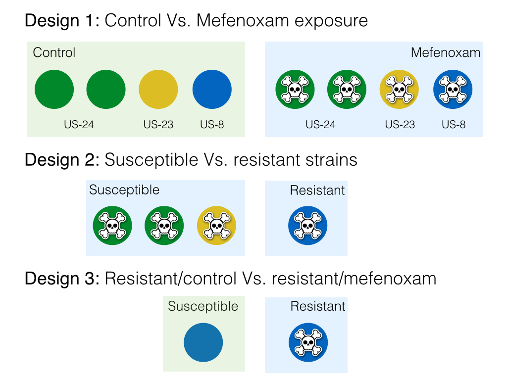
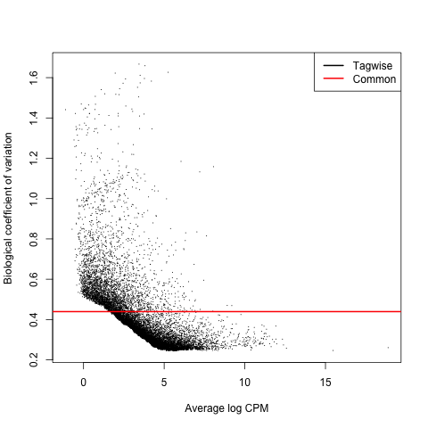
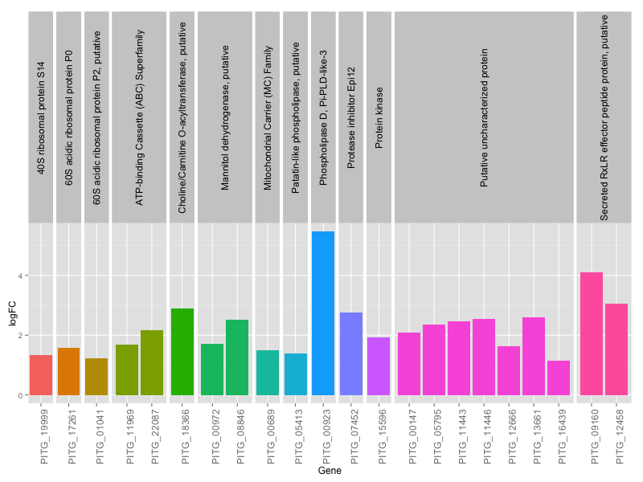
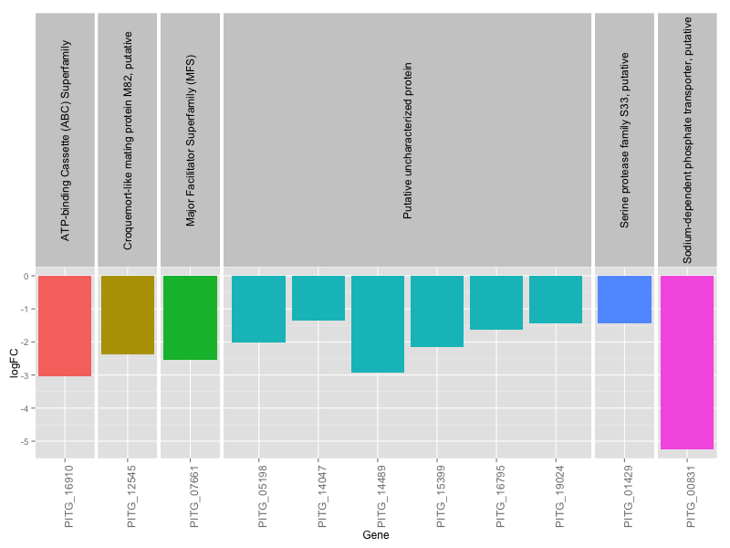
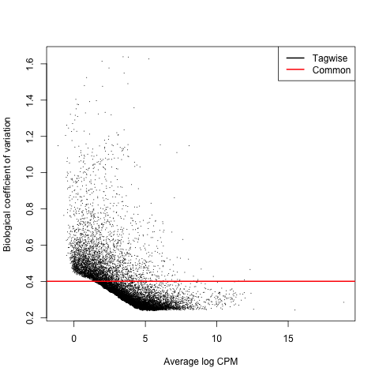
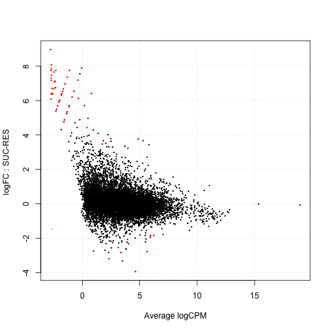
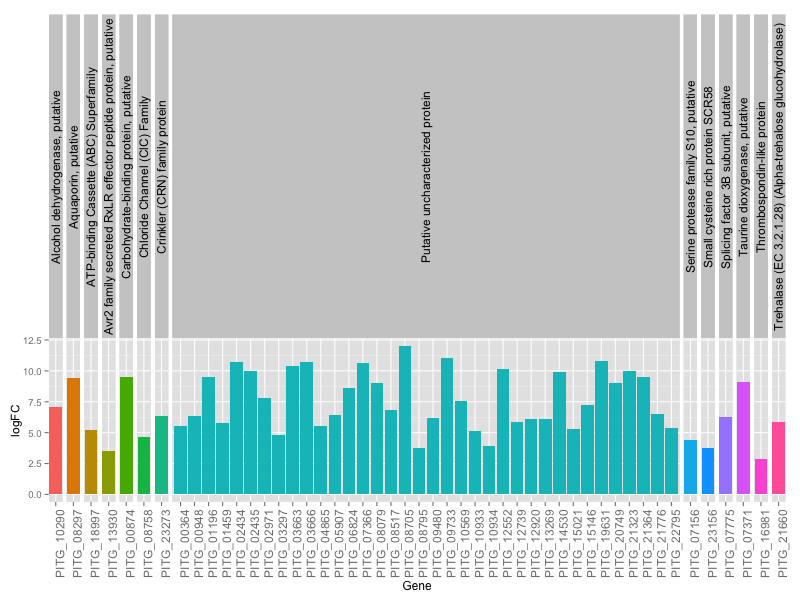
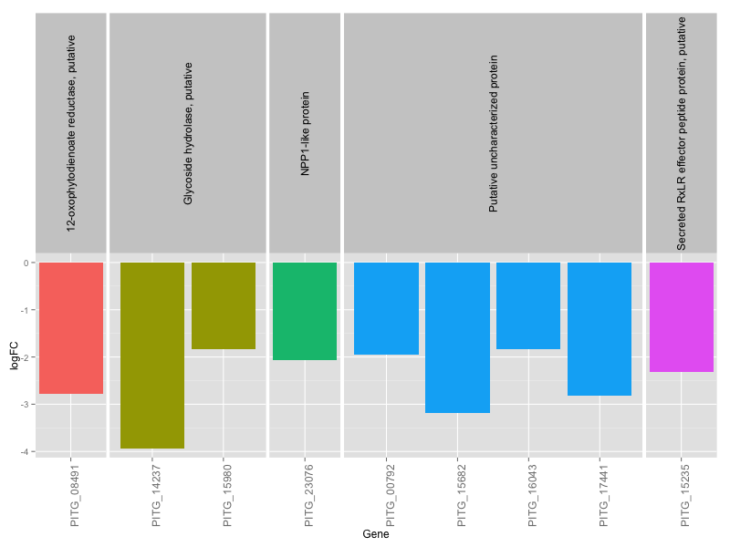
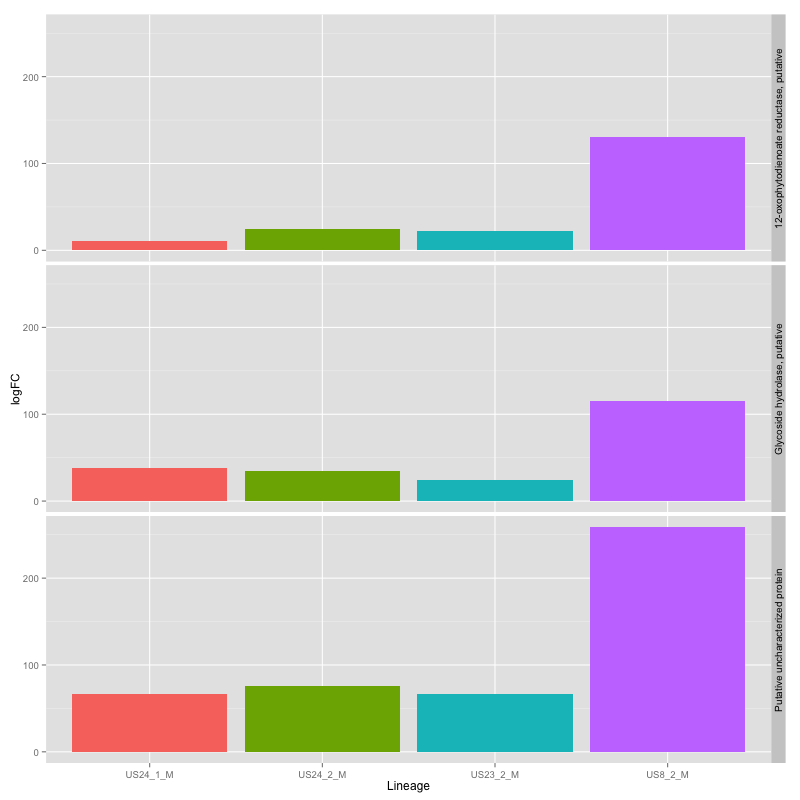
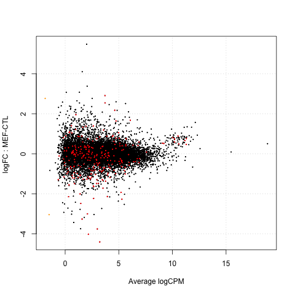

# Fungicide resistance as a consequence of differential expression in Phytophtora infestans
###Javier F. Tabima

***

# Introduction

Adquired resistance to fungicides has been a problem in the mechanisms of control of destructive plant pathogens. Resistance has been increasing in recent years and an emergence of resistant pathogens has been reported. This trend has been observed in one of the most important plant pathogens known: *Phytophthora infestans*, the causal agent of potato and tomato late blight. *P. infestans* is a destructive pathogen that caused the great Irish famine of 1845, resulting on million of deaths and mass emigration. Late blight disease causes losses of million of dollars every year due to loss of entire crops. To treat leat blight, application of metalaxyl/mefanoxam has been used with mixed results, but it still remains as the most used fungicide mechanism to avoid late blight disease worldwide.

The most common lineages in the United States, lineages **US-24 and US-23**, have not adquired resistance yet and remain susceptible to the fungicide treatment but the emergence of new or exotic lineages can lead to lineages with resistance. Recently, it has been reported that the new **US-8** lineage has adquired resistance to mefenoxam/metalaxyl, but the mechanisms of resistance are still unknown. The emergence of the lineage US-8 is still unknown, but a recent analysis shows that US-8 has emerged from the US-22 lineage (Figure 1), and that the resistance to metalaxyl can be due a mutation in the new lineage or to differences in gene expression in the new resistant lineage. 

We hypothesize that the resistance to fungicides is mediated by differential gene expression in resistant strains when compared to suceptible strains. To test this hypothesis we want to answer the following questions:

* Are there any differentially expressed genes when the pathogen is exposed to the fungicide?
* Which genes are differentially expressed in resistant strains when compared to susceptible strains?
* Which genes are active in the resistance response to the fungicide in a resistant strain?

To answer these questions we want to measure differential expression using whole RNA sequencing (RNAseq). We determined a list of genes differentially expressed in each of the scenarios.

# Methods

## RNA data

We used RNAseq data extracted by [Childers *et al.* (2015)](http://apsjournals.apsnet.org/doi/abs/10.1094/PHYTO-05-14-0148-R?url_ver=Z39.88-2003&rfr_id=ori:rid:crossref.org&rfr_dat=cr_pub%3dpubmed). The authors extracted RNA of three different strains: The suceptible strains **US-24** (2 samples) and **US-22**, and the resistant strain **US-8**. Two treatments were used: **fungicide exposure** using 100mg/ul Mefenoxam in Pea agar, and **control** with no fungicide exposure. Each of the strains were subitted to each treatment by triplicate, and RNA was extracted and sequenced using Illumina technology.

## RNAseq analysis

**Figure 2** resumes the protocol used in this study. The reads were obtained from NCBI short sequence archive (SRA, accession number [SRP049521](http://www.ncbi.nlm.nih.gov/Traces/sra?study=SRP049521)) and converted to FASTQ format. The reads were assembled to the *P. infestans* T30-4 reference genome ([Haas *et al.*, 2009](http://www.ncbi.nlm.nih.gov/pubmed/19741609)) using [Tophat2](http://ccb.jhu.edu/software/tophat/index.shtml) to acknowledge differential spliced variants. The assembled reads were sorted using [Samtools](http://samtools.sourceforge.net/) and the read were counted using [htseq-count](http://www-huber.embl.de/HTSeq/doc/overview.html). 

## Differential expression analysis

The differential expression analysis was performed in [edgeR](http://bioinformatics.oxfordjournals.org/content/26/1/139.long) using three different models (Figure 3):

  * Control vs. fungicide exposure (Figure 3a)
  * Susceptible lineages vs. resistant lineages (under fungicide exposure) (Figure 3b)
  * Resistant lineages: Control vs. fungicide exposure (Figure 3c)
  
  
  **Figure 3**. Experimental design.

Each of the datasets were normalized by biological variance, 

# Results

## Control vs. fungicide exposure 

After normalization (Figure 4a), a total of 33 genes were differentially expressed (Table 1, Figure 4b). Out of these 33 genes, 22 are up-regulated and 11 are down-regulated. 

**Figure 4a**. Mean-variance relationship for dataset1.

**Figure 4b**. Fold changes per gene. Differentially expressed genes are in red.

***

**Table 1**. Differentially expressed genes. logFC is the log of the **fold change**. Every gene is significanlly differentially expressed. 

|Gene       |     logFC|     logCPM|       LR|   PValue|       FDR|Function                                         |
|:----------|---------:|----------:|--------:|--------:|---------:|:------------------------------------------------|
|PITG_00923 |  5.474320|  3.7820788| 49.27029| 0.00e+00| 0.0000000|Phospholipase D, Pi-PLD-like-3                   |
|PITG_09160 |  4.099922|  2.7394632| 19.02140| 1.29e-05| 0.0064323|Secreted RxLR effector peptide protein, putative |
|PITG_12458 |  3.065262|  0.8450301| 23.79215| 1.10e-06| 0.0009740|Secreted RxLR effector peptide protein, putative |
|PITG_18366 |  2.905833|  4.3549661| 17.94625| 2.27e-05| 0.0084561|Choline/Carnitine O-acyltransferase, putative    |
|PITG_07452 |  2.764468|  3.1062844| 20.01264| 7.70e-06| 0.0045940|Protease inhibitor Epi12                         |
|PITG_13661 |  2.595692|  5.2669791| 22.68463| 1.90e-06| 0.0014249|Putative uncharacterized protein                 |
|PITG_11446 |  2.541470|  4.2201078| 24.83081| 6.00e-07| 0.0008904|Putative uncharacterized protein                 |
|PITG_08846 |  2.507803|  6.1187435| 36.79994| 0.00e+00| 0.0000052|Mannitol dehydrogenase, putative                 |
|PITG_11443 |  2.455122|  4.5736959| 24.23928| 9.00e-07| 0.0009740|Putative uncharacterized protein                 |
|PITG_05795 |  2.357101|  2.9204614| 23.28019| 1.40e-06| 0.0011150|Putative uncharacterized protein                 |
|PITG_22087 |  2.169662|  5.2222009| 52.95111| 0.00e+00| 0.0000000|ATP-binding Cassette (ABC) Superfamily           |
|PITG_00147 |  2.081967|  3.8132619| 18.05823| 2.14e-05| 0.0082542|Putative uncharacterized protein                 |
|PITG_15596 |  1.936599|  2.4066439| 18.73505| 1.50e-05| 0.0066437|Protein kinase                                   |
|PITG_00972 |  1.712332|  4.3596607| 20.12223| 7.30e-06| 0.0045665|Mannitol dehydrogenase, putative                 |
|PITG_11969 |  1.695617|  6.9632925| 25.19406| 5.00e-07| 0.0008845|ATP-binding Cassette (ABC) Superfamily           |
|PITG_12666 |  1.623773|  5.1389233| 24.69675| 7.00e-07| 0.0008904|Putative uncharacterized protein                 |
|PITG_17261 |  1.564249| 12.3332691| 25.77844| 4.00e-07| 0.0007622|60S acidic ribosomal protein P0                  |
|PITG_00689 |  1.504732|  5.3607272| 18.33541| 1.85e-05| 0.0076284|Mitochondrial Carrier (MC) Family                |
|PITG_05413 |  1.401121|  5.8226489| 24.07570| 9.00e-07| 0.0009740|Patatin-like phospholipase, putative             |
|PITG_19999 |  1.326196| 11.9293252| 18.50332| 1.70e-05| 0.0072344|40S ribosomal protein S14                        |
|PITG_01041 |  1.229572| 10.0450499| 18.14087| 2.05e-05| 0.0081670|60S acidic ribosomal protein P2, putative        |
|PITG_16439 |  1.135680|  5.8351868| 17.89323| 2.34e-05| 0.0084561|Putative uncharacterized protein                 |
|PITG_14047 | -1.363799|  4.7292721| 18.84482| 1.42e-05| 0.0065133|Putative uncharacterized protein                 |
|PITG_19024 | -1.423289|  4.7664872| 20.63553| 5.60e-06| 0.0039029|Putative uncharacterized protein                 |
|PITG_01429 | -1.433791|  4.7261147| 23.67293| 1.10e-06| 0.0009740|Serine protease family S33, putative             |
|PITG_16795 | -1.638038|  4.8123753| 19.45633| 1.03e-05| 0.0056938|Putative uncharacterized protein                 |
|PITG_05198 | -2.025492|  5.8649005| 18.90295| 1.38e-05| 0.0065133|Putative uncharacterized protein                 |
|PITG_15399 | -2.155291|  4.5267987| 20.30697| 6.60e-06| 0.0043764|Putative uncharacterized protein                 |
|PITG_12545 | -2.367387|  5.3979636| 35.57184| 0.00e+00| 0.0000073|Croquemort-like mating protein M82, putative     |
|PITG_07661 | -2.530772|  6.0096949| 33.46136| 0.00e+00| 0.0000174|Major Facilitator Superfamily (MFS)              |
|PITG_14489 | -2.917295|  0.5793940| 19.30851| 1.11e-05| 0.0057747|Putative uncharacterized protein                 |
|PITG_16910 | -3.036024|  3.3808366| 23.87543| 1.00e-06| 0.0009740|ATP-binding Cassette (ABC) Superfamily           |
|PITG_00831 | -5.257199|  0.4753956| 19.42032| 1.05e-05| 0.0056938|Sodium-dependent phosphate transporter, putative |

***

**Figure 4c.** Upregulated genes in dataset 1.

**Figure 4d.** Downregulated genes in dataset 2.

## Susceptible lineages vs. resistant lineages

After normalization (Figure 5a), a total of 58 genes were differentially expressed (Figure 5b & Figure 5c). Out of these 58 genes, 49 are up-regulated and 9 are down-regulated. 

Of the up-regulated genes we can find the followin really interesting genes:

|Gene       |    US24_1_M|  US24_2_M|   US23_2_M|     US8_2_M|Function                                                     |
|:----------|-----------:|---------:|----------:|-----------:|:------------------------------------------------------------|
|PITG_16043 |  29.2677232| 46.411051|  42.368717| 140.2812834|Phosphatidylinositol binding protein                         |
|PITG_08491 |  10.3921626| 24.326503|  22.305151| 129.9632548|12-oxophytodienoate reductase, putative                      |
|PITG_15980 |  37.5693342| 35.098197|  23.993258| 115.6622789|Glycoside hydrolase, putative                                |

Apparently all these genes are interacting with the metalaxil (more info to follow)

***

**Figure 4a**. Mean-variance relationship for dataset1.

**Figure 4b**. Fold changes per gene. Differentially expressed genes are in red.

***

**Table 2**. Differentially expressed genes. logFC is the log of the **fold change**. Every gene is significanlly differentially expressed. 

|Gene       |     logFC|    logCPM|       LR|   PValue|       FDR|Function                                                     |
|:----------|---------:|---------:|--------:|--------:|---------:|:------------------------------------------------------------|
|PITG_08705 | 12.025573| 3.4930357| 53.12254| 0.00e+00| 0.0000000|Putative uncharacterized protein                             |
|PITG_09733 | 11.082110| 2.5559166| 27.62803| 1.00e-07| 0.0000770|Putative uncharacterized protein                             |
|PITG_19631 | 10.829834| 2.3079972| 34.73689| 0.00e+00| 0.0000052|Putative uncharacterized protein                             |
|PITG_03666 | 10.714894| 2.1948386| 38.05244| 0.00e+00| 0.0000013|Putative uncharacterized protein                             |
|PITG_02434 | 10.700051| 2.1801399| 36.73590| 0.00e+00| 0.0000021|Putative uncharacterized protein                             |
|PITG_07366 | 10.609837| 2.0907940| 37.94373| 0.00e+00| 0.0000013|Putative uncharacterized protein                             |
|PITG_03663 | 10.385885| 1.8697235| 30.83598| 0.00e+00| 0.0000206|Putative uncharacterized protein                             |
|PITG_12552 | 10.183200| 1.6739107| 31.88838| 0.00e+00| 0.0000128|Putative uncharacterized protein                             |
|PITG_21323 | 10.020155| 1.5122629| 29.51234| 1.00e-07| 0.0000359|Putative uncharacterized protein                             |
|PITG_02435 |  9.996232| 1.4897441| 32.01538| 0.00e+00| 0.0000128|Putative uncharacterized protein                             |
|PITG_14530 |  9.920909| 1.4145785| 27.44365| 2.00e-07| 0.0000808|Putative uncharacterized protein                             |
|PITG_00874 |  9.529772| 1.0363119| 29.12795| 1.00e-07| 0.0000414|Carbohydrate-binding protein, putative                       |
|PITG_21364 |  9.501524| 1.0117914| 22.23351| 2.40e-06| 0.0007740|Putative uncharacterized protein                             |
|PITG_01196 |  9.469130| 0.9792245| 27.96109| 1.00e-07| 0.0000680|Putative uncharacterized protein                             |
|PITG_08297 |  9.420741| 0.9234593| 23.13728| 1.50e-06| 0.0005527|Aquaporin, putative                                          |
|PITG_07371 |  9.092904| 0.6153364| 25.89869| 4.00e-07| 0.0001629|Taurine dioxygenase, putative                                |
|PITG_20749 |  9.017329| 0.5469067| 25.61883| 4.00e-07| 0.0001759|Putative uncharacterized protein                             |
|PITG_08079 |  9.013667| 0.5337100| 25.84249| 4.00e-07| 0.0001629|Putative uncharacterized protein                             |
|PITG_06824 |  8.593158| 0.1392920| 25.30281| 5.00e-07| 0.0001995|Putative uncharacterized protein                             |
|PITG_02971 |  7.803872| 3.4853406| 55.76573| 0.00e+00| 0.0000000|Putative uncharacterized protein                             |
|PITG_10569 |  7.595199| 2.3652365| 33.28725| 0.00e+00| 0.0000087|Putative uncharacterized protein                             |
|PITG_15146 |  7.205148| 1.9814141| 26.11543| 3.00e-07| 0.0001537|Putative uncharacterized protein                             |
|PITG_10290 |  7.111551| 2.8008085| 32.06910| 0.00e+00| 0.0000128|Alcohol dehydrogenase, putative                              |
|PITG_08517 |  6.817084| 1.6040726| 18.71400| 1.52e-05| 0.0035517|Putative uncharacterized protein                             |
|PITG_21776 |  6.527872| 1.3173164| 25.11265| 5.00e-07| 0.0002123|Putative uncharacterized protein                             |
|PITG_05907 |  6.460812| 2.1588375| 30.26241| 0.00e+00| 0.0000259|Putative uncharacterized protein                             |
|PITG_23273 |  6.379380| 3.5958191| 50.77001| 0.00e+00| 0.0000000|Crinkler (CRN) family protein                                |
|PITG_00948 |  6.378384| 1.1820239| 17.84858| 2.39e-05| 0.0049609|Putative uncharacterized protein                             |
|PITG_07775 |  6.232694| 1.0341392| 22.64495| 2.00e-06| 0.0006694|Splicing factor 3B subunit, putative                         |
|PITG_09480 |  6.169079| 0.9695336| 20.02880| 7.60e-06| 0.0021726|Putative uncharacterized protein                             |
|PITG_13269 |  6.120177| 1.8241393| 21.81513| 3.00e-06| 0.0009167|Putative uncharacterized protein                             |
|PITG_12920 |  6.074236| 2.3320739| 28.33305| 1.00e-07| 0.0000591|Putative uncharacterized protein                             |
|PITG_21660 |  5.869603| 0.6847770| 22.75178| 1.80e-06| 0.0006536|Trehalase (EC 3.2.1.28) (Alpha-trehalose glucohydrolase)     |
|PITG_12739 |  5.845438| 0.6600819| 22.39301| 2.20e-06| 0.0007401|Putative uncharacterized protein                             |
|PITG_01459 |  5.755172| 0.5742656| 19.24742| 1.15e-05| 0.0028686|Putative uncharacterized protein                             |
|PITG_04865 |  5.565517| 1.2807571| 18.43802| 1.76e-05| 0.0039374|Putative uncharacterized protein                             |
|PITG_00364 |  5.538088| 0.3631076| 20.00888| 7.70e-06| 0.0021726|Putative uncharacterized protein                             |
|PITG_22795 |  5.344552| 0.1861022| 20.38017| 6.40e-06| 0.0018860|Putative uncharacterized protein                             |
|PITG_15021 |  5.266273| 0.9918331| 18.26357| 1.92e-05| 0.0041483|Putative uncharacterized protein                             |
|PITG_18997 |  5.237243| 0.0878202| 19.39940| 1.06e-05| 0.0027107|ATP-binding Cassette (ABC) Superfamily                       |
|PITG_10933 |  5.162614| 0.8960023| 19.89383| 8.20e-06| 0.0021948|Putative uncharacterized protein                             |
|PITG_03297 |  4.801767| 0.5492387| 17.21592| 3.34e-05| 0.0066677|Putative uncharacterized protein                             |
|PITG_08758 |  4.682198| 0.4405193| 18.60486| 1.61e-05| 0.0036826|Chloride Channel (ClC) Family                                |
|PITG_07156 |  4.412750| 2.2350928| 19.89849| 8.20e-06| 0.0021948|Serine protease family S10, putative                         |
|PITG_10934 |  3.928278| 2.0472851| 16.96889| 3.80e-05| 0.0074583|Putative uncharacterized protein                             |
|PITG_08795 |  3.781886| 4.0020357| 19.70750| 9.00e-06| 0.0023619|Putative uncharacterized protein                             |
|PITG_23156 |  3.767004| 6.3710924| 33.36763| 0.00e+00| 0.0000087|Small cysteine rich protein SCR58                            |
|PITG_13930 |  3.512037| 3.4424725| 22.19405| 2.50e-06| 0.0007740|Avr2 family secreted RxLR effector peptide protein, putative |
|PITG_16981 |  2.886470| 4.0866363| 18.82828| 1.43e-05| 0.0034178|Thrombospondin-like protein                                  |
|PITG_16043 | -1.833680| 6.0139635| 16.45727| 4.98e-05| 0.0094302|Putative uncharacterized protein                             |
|PITG_15980 | -1.843809| 5.7311041| 16.74789| 4.27e-05| 0.0082324|Glycoside hydrolase, putative                                |
|PITG_00792 | -1.950857| 5.7177288| 19.17724| 1.19e-05| 0.0029098|Putative uncharacterized protein                             |
|PITG_23076 | -2.070085| 3.7594321| 17.49704| 2.88e-05| 0.0058574|NPP1-like protein                                            |
|PITG_15235 | -2.320530| 3.8516771| 18.26240| 1.92e-05| 0.0041483|Secreted RxLR effector peptide protein, putative             |
|PITG_08491 | -2.772784| 5.5477319| 32.12200| 0.00e+00| 0.0000128|12-oxophytodienoate reductase, putative                      |
|PITG_17441 | -2.827125| 3.2876142| 17.91378| 2.31e-05| 0.0048860|Putative uncharacterized protein                             |
|PITG_15682 | -3.190029| 2.3230492| 23.77335| 1.10e-06| 0.0004108|Putative uncharacterized protein                             |
|PITG_14237 | -3.932151| 4.8487478| 63.79746| 0.00e+00| 0.0000000|Glycoside hydrolase, putative                                |

**Figure 5c.** Upregulated genes in dataset 1.

**Figure 5d.** Downregulated genes in dataset 2.

**Figure 5e. ** Upregulated genes in US8

## Resistant lineages: Control vs. fungicide exposure

After normalization (Figure 3a), a total of 246 genes were differentially expressed, where 166 were up-regulated and 80 are down-regulated

**Figure 6a**. Mean-variance relationship for dataset1.

**Figure 6b**. Fold changes per gene. Differentially expressed genes are in red.

***

Since there are so many genes, we will only use the top 5 and bottom 5 genes.

|           |    logFC|   logCPM|        LR|   PValue|       FDR|
|:----------|--------:|--------:|---------:|--------:|---------:|
|PITG_22020 | 11.77737| 3.347854|  19.00495| 1.30e-05| 0.0011886|
|PITG_08705 | 11.70889| 3.293415| 105.72464| 0.00e+00| 0.0000000|
|PITG_19631 | 10.71393| 2.298768|  61.31350| 0.00e+00| 0.0000000|
|PITG_09714 | 10.66174| 2.238727|  15.76281| 7.18e-05| 0.0046103|
|PITG_04800 | 10.62422| 2.204358|  16.63578| 4.53e-05| 0.0032005|
|PITG_02860 | -4.456376| 4.410900|  22.00664| 2.7e-06| 0.0003489|
|PITG_14237 | -4.490672| 5.146294| 127.74464| 0.0e+00| 0.0000000|
|PITG_08621 | -4.550188| 3.980926|  30.72034| 0.0e+00| 0.0000085|
|PITG_16913 | -4.639182| 3.267118|  30.02173| 0.0e+00| 0.0000111|
|PITG_07424 | -6.514476| 4.238426|  24.58000| 7.0e-07| 0.0001179|

There are genes not expressed in the control expressed on the mefenoxam treatment:

|           |    logFC|   logCPM|        LR|   PValue|       FDR|
|:----------|--------:|--------:|---------:|--------:|---------:|
|PITG_04266|0|0|0|3.75107568708433|5.2424776006083|1.86088537438791|
|PITG_15648|0|0|0|1.87553784354217|2.2467761145464|1.27323736142331|
